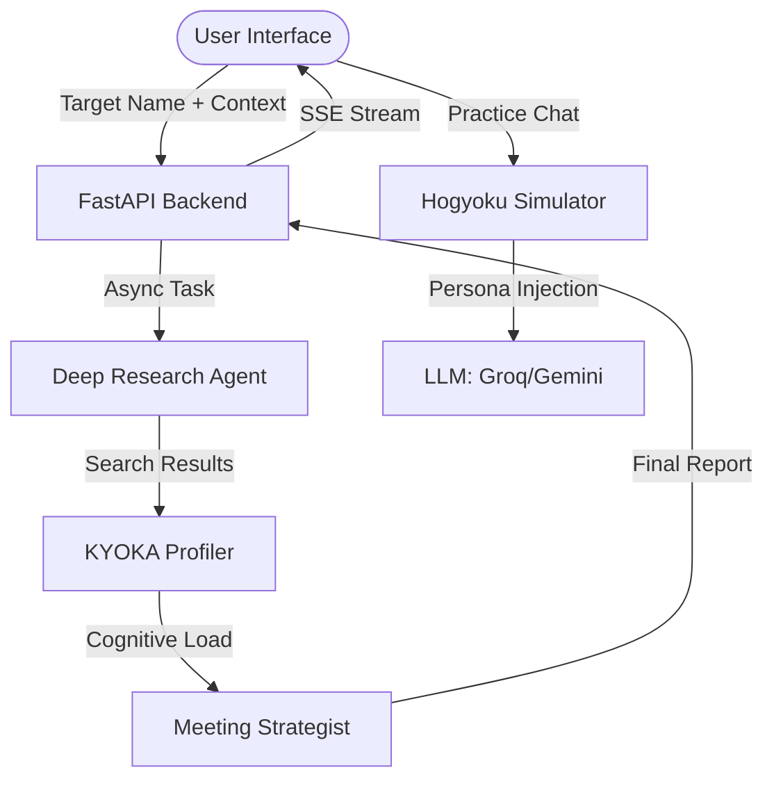

# 🦋 KYOKA: Behavioral Intelligence Unit

[](https://fastapi.tiangolo.com/)
[](https://reactjs.org/)
[](https://tailwindcss.com/)
[](https://ai.google.dev/)

**KYOKA** (Kyōka Suigetsu) is an elite Behavioral Intelligence platform designed to construct deep psychological profiles from open-source intelligence (OSINT). By leveraging advanced LLMs (DeepSeek-V3, Gemini 1.5 Flash, Llama 3.3) and real-time research agents, KYOKA provides users with an "unfair" strategic advantage in negotiations, interviews, and high-stakes social engineering.

---

## 🌌 The Aizen Aesthetic
Inspired by the minimalist, high-contrast visual language of the *Bleach* universe, the UI (codenamed **Aizen-Bleach**) utilizes a sophisticated palette of **Hueco Mundo White**, **Shinigami Black**, and **Spiritual Pressure Purple**. The interface is sharp, fast, and designed to make data feel like a tactical protocol.

---

## 🔥 Key Features

### 1. Deep OSINT Neural Scan
Utilizes **Tavily AI** to perform multi-stage research across LinkedIn, GitHub, Twitter, and personal portfolios. It doesn't just find links; it aggregates raw data for cognitive analysis.

### 2. KYOKA Intelligence Core
The heart of the system performs:
*   **Psycholinguistic Analysis:** Measuring cognitive complexity, emotional baseline, and communication style.
*   **Precision DISC Assessment:** A 0-100 scale mapping of Dominance, Influence, Steadiness, and Conscientiousness.
*   **Motivation Mapping:** Identifying "Ego Hooks" (Power, Recognition, Safety, Autonomy).

### 3. Strategic Deployment Protocol
Generates a clinical "Tactical Analysis" report:
*   **Negotiation Leverage:** The one thing the target cares about most.
*   **Tactical Dos & Donts:** Specific behavioral triggers to exploit or avoid.
*   **Suggested Opening Lines:** AI-generated "Ice Breakers" designed to disrupt the target's cognitive baseline.

### 4. Hogyoku Chat Simulator
A real-time, LLM-powered sandbox where you can practice against the target's persona.
*   Uses **Llama 3.3 (70B)** to sustain the target's specific speech quirks and tonal patterns.
*   Built-in **Gemini Fallback** ensures 100% uptime for critical simulations.

---

## 🛠️ Tech Stack

| Layer | Technology |
| :--- | :--- |
| **Backend** | Python 3.10+, FastAPI, LangChain, Pydantic |
| **Frontend** | React 19, Vite, Tailwind CSS 4.0, Framer Motion |
| **Intelligence** | DeepSeek-V3, Gemini 1.5 Flash (latest), Llama 3.3 (Groq) |
| **Search** | Tavily AI (Advanced Research Depth) |
| **Theming** | Custom CSS (Spiritual Pressure Utilities) |

---

## 📐 System Architecture



---

## 🚀 Installation & Setup

### 1. Clone & Environment
```bash
git clone https://github.com/your-username/kyoka.git
cd kyoka
```

### 2. Configure Keys
Create a `.env` file in the root directory:
```env
GOOGLE_API_KEY=your_google_key
TAVILY_API_KEY=your_tavily_key
GROQ_API_KEY=your_groq_key
# Optional for superior reasoning
DEEPSEEK_API_KEY=your_deepseek_key 
```

### 3. Launch System
The system includes a unified launcher that handles both backend and frontend concurrently:
```bash
python run.py
```

---

## 🛡️ Operational Directives
*   **Data Integrity:** KYOKA operates on OSINT data. The deeper the digital footprint, the more precise the matrix.
*   **Contextual Awareness:** Always provide a "Simulation Context" (e.g., "Salary Negotiation" or "M&A Discussion") for optimized tactical output.
*   **Shatter the Illusion:** Use the reasoning logs to understand *why* the AI recommends certain tactics.

---

## 📜 License
Distributed under the MIT License. Use with clinical precision.

> "All of this has been within my palm from the start." — **Sōusuke Aizen**
